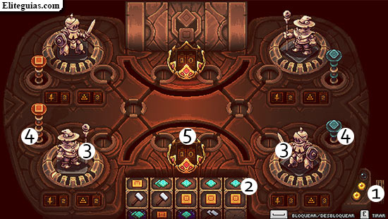

# CyberSpinner

## Índice

1. [Descripción](#descripción)
2. [Tecnologías Utilizadas](#tecnologías-utilizadas)
3. [Mecánicas de Juego](#mecánicas-de-juego)
   - [Rodillos de la Fortuna](#🌀-rodillos-de-la-fortuna)
   - [Estaciones de Ataque](#🤖-estaciones-de-ataque)
   - [Combate en el Ciberespacio](#⚔️-combate-en-el-ciberespacio)
   - [Objetivo del Juego](#🏆-objetivo-del-juego)
4. [Arte y Estilo](#arte-y-estilo)
   - [Arte](#arte)
   - [Cámaras](#cámaras)
   - [Música y Sonido](#música-y-sonido)
5. [Historia y Ambientación](#historia-y-ambientación)
6. [Integración con Plataformas y Servicios](#integración-con-plataformas-y-servicios)
7. [Notas Finales](#notas-finales)
8. [Referencias](#referencias)

## Descripción

"CyberSpinner" es un juego de azar y estrategia por turnos, modo multijugador 1VS1,  en el que dos jugadores asumen el papel de hackers adversarios que se enfrentan en el ciberespacio. La clave del juego es hacer girar unos "rodillos de la fortuna" para determinar las acciones disponibles en cada turno y elegir sabiamente cómo usar los recursos obtenidos para derrotar al oponente.

## Tecnologías Utilizadas

- Unity 2022 (Motor de Juego)
- [Otras tecnologías que planeas utilizar...]

## Mecánicas de Juego (Eventos en orden de aparición durante una partida)

### 🌀 Rodillos de la Fortuna:
- El jugador que empieza primero se define de forma aleatoria.
- Los jugadores giran los rodillos de la fortuna al comienzo de su turno.
- Los resultados de los rodillos determinan las acciones disponibles, como aumentar la energía, mejorar personajes o crear escudos. 

### 🤖 Estaciones de Ataque:
- Cada jugador controla un equipo de 2 servidores/malware, cada uno con habilidades únicas.
- Los personajes pueden subir de nivel con recursos ganados en el juego mediante el giro de los rodillos.

### ⚔️ Combate en el Ciberespacio:
- Los jugadores pueden atacar a los personajes de sus oponentes cuando su barra de energía está llena.
- El combate se resuelve mediante enfrentamientos estratégicos basados en las habilidades de los personajes y las decisiones tácticas.

### 🏆 Objetivo del Juego:
- El objetivo es atacar y terminar con las vidas (10) del oponente antes de que lo haga.

## Arte y Estilo

### Arte:
- Estilo cibernético y futurista, colores saturados y transparencias.
- Arte 3D low-poly

### Cámaras:
- Vista Cenital Fija

### Música y Sonido:
- Música electrónica/experimental/ 1990s
- Efectos de sonido relacionados con la ciberseguridad y el hacking. Digital Lofi//Modems

## Historia y Ambientación

- Simple, el juego se desarrolla en un mundo virtual donde cada jugador asume el papel de un hacker y compite contra otro.

## Integración con Plataformas y Servicios

- Integración con la plataforma de juego en la nube para partidas multijugador en línea.
- Opciones de autenticación de usuarios a través de Firebase Authentication o PlayFab.

## Notas Finales

Este Game Design Document (GDD) proporciona una visión general del juego "CyberSpinner" y sus características principales. Es un documento vivo que puede evolucionar a medida que se desarrolla el proyecto.

## Referencias

La Referencia principal es el minijuego "Girarodillos" del juego JRPG Sea of Stars (Juego local) desarrollado por Sabotage Studios.

Este proyecto se podria resumir como una implementacion online de las mecanicas de dicho minijuego.

https://store.steampowered.com/app/1244090/Sea_of_Stars/

https://www.eliteguias.com/guias/s/sos/sea-of-stars_girarrodillos.php

https://www.youtube.com/watch?v=H0u93GogDto

https://sabotagestudio.com