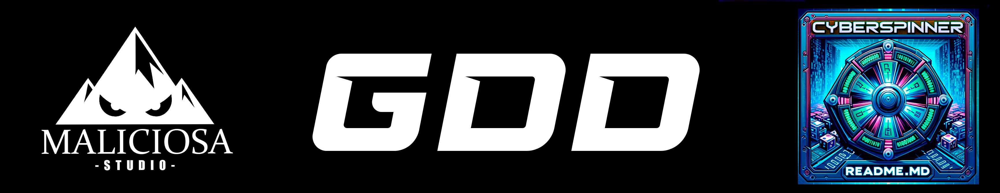
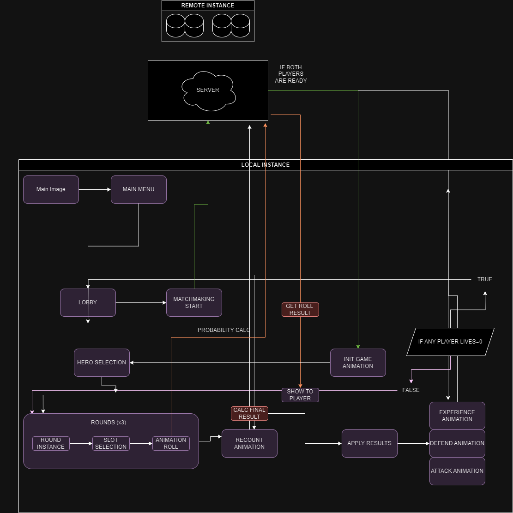

# 🎮 CyberSpinner: Game Dev Document by Maliciosa Studio 
#

    

###### Maliciosa Studio 2024

### 📚 General Index

1. [🔍 Description](#-description)
2. [💻 Technologies Used](#-technologies-used)
3. [🕹️ Game Mechanics and Style](#-game-mechanics-and-style)
   - [🤖 Player Stations (Malware Selection)](#-player-stations-malware-selection)
   - [🦠 Types of Malware in CyberSpinner](#-types-of-malware-in-cyberspinner)
   - [🎯 Types of Attack in CyberSpinner](#-types-of-attack-in-cyberspinner)
   - [🌀 Random Code Spin (Action Selection)](#-random-code-spin-action-selection)
   - [🔥 Code Symbols](#-code-symbols)
   - [⚔️ Combat (Energy Increase - Energy Symbols)](#-combat-energy-increase---energy-symbols)
   - [🔥 Defense Firewall (Building a Firewall - Defense Symbols)](#-defense-firewall-building-a-firewall---defense-symbols)
   - [🔥 Malware Upgrade (Software Upgrade - Upgrade Symbols)](#-malware-upgrade-software-upgrade---upgrade-symbols)
   - [🏆 Game Objective](#-game-objective)
4. [🎨 Art and Style](#-art-and-style)
   - [🖼️ Art](#-art)
   - [📷 Cameras](#-cameras)
   - [🎵 Music and Sound](#-music-and-sound)
5. [📖 Story and Setting](#-story-and-setting)
6. [🔗 Integration with Platforms and Services](#-integration-with-platforms-and-services)
7. [📝 Final Notes](#-final-notes)
8. [🔍 References](#-references)
9. [📚 CODE INFRASTRUCTURE](#-code-infrastructure)
   - [🔍 General Diagram](#-general-diagram)
   - [🔍 Task Distribution](#-task-distribution)
   - [🔍 Textual Flowcharts](#-textual-flowcharts)
      - [🌐 Server Connection](#-server-connection)
      - [🏠 Main Menu Flows](#-main-menu-flows)
      - [🛡️ Hero Selection and Gameplay](#-hero-selection-and-gameplay)
      - [🏁 End Conditions](#-end-conditions)
10. [📚 Development Style Guide](#-development-style-guide)
11. [🔍 Nomenclature](#-nomenclature)

## 🔍 Description

"CyberSpinner" is a turn-based strategy and chance game, in a 1VS1 multiplayer mode, where two players take on the roles of opposing hackers facing each other in cyberspace. The key to the game is spinning a "Random Code made up of symbols" to determine the actions available each turn and wisely choosing how to use the resources obtained to defeat the opponent.

## 💻 Technologies Used

- Game Engine: Unity 2022.3.18f1 LTS - Basic Subscription.
- IDE: VS Code 1.85.2
- Version Control: GIT 2.43.0 - Monolithic Repository
- Repository: GitHub - https://github.com/Cyber-Spinner
- IAC: Terraform
- IAC: Kubernetes/Docker
- Others

## 🕹️ Game Mechanics and Style

### 🤖 Player Stations (Malware Selection):

- Each player controls a "Station", consisting of the graphical representation of 2 "Malware" and a central code.
- There are different types of "Malware," and the player must choose only 2 for each battle.
- Each malware type has a way of behaving in battle.
- The selection of malware type is agnostic to the opponent and is only revealed once the "Malware Selection" phase has passed.
- The "Malware" of each opponent will behave according to the values obtained during their Code Spin.

### 🌀 Random Code Spin (Action Selection):

- The player who spins first is defined randomly (TODO: Find a representative random element).
- The random code consists of 5 slots for symbols.
- Players spin the Random Code at the beginning of their turn, and when it stops, they obtain certain values.
- The results of the random codes determine the available actions, such as increasing energy, upgrading characters, or creating shields.
- Each player has 3 spins per turn, being able to lock up to 3 code slots which will remain fixed in the next spin.
- Once the 3 spins are exhausted, the result of the code will be applied to the player's station, and the corresponding action will be carried out.

### 🦠 Types of Malware in CyberSpinner

- This section defines the types of malware selectable by the player.

  ### 🗡️ Adware (Warrior):
- **Energy Needed to Attack**: Low
- **Damage**: Medium
- **Evolution**:
  - Level 1 to 2: Moderate Energy
  - Level 2 to 3: High Energy

  Keywords: speed, cheap, decision, sharp, spam, low cost

  What it is:
  An Adware that attacks quickly and in a standard way, filling the enemy's station with spam and advertisements, sends poisoned emails.

  ### 🧙‍♂️ Polymorphic Virus (Mage):
- **Energy Needed to Attack**: Medium
- **Damage**: High
- **Evolution**:
  - Level 1 to 2: High Energy
  - Level 2 to 3: Very High Energy

  Keywords: Polymorphism, Evolution, Conversion, Transmutation, Upgrade, high technology

  What it is:
  A virus that mutates and attacks twice per turn in two different ways.

  ### 🏹 Trojan (Archer):
- **Energy Needed to Attack**: High
- **Damage**: High
- **Evolution**:
  - Level 1 to 2: High Energy
  - Level 2 to 3: Extremely High Energy

  Keywords: Precise, definitive, high cost, performance, made to last, sturdy, reliable

  What it is:
  A Trojan virus that usually hits the target and causes a lot of damage at a high cost, deletes enemy system files.

  ### 🛠️ Rootkit (Engineer):
- **Energy Needed to Attack**: Medium
- **Damage**: Low
- **Evolution**:
  - Level 1 to 2: Low Energy
  - Level 2 to 3: Moderate Energy

  Keywords: Low cost, builder, code, repair, analysis, search, fix, available, check, scanner

  What it is:
  A toolkit that allows extracting information from the enemy to analyze the system and repair the firewall, compares stations for improvement.

  ### 🕵️‍♂️ Spyware (Assassin):
- **Energy Needed to Attack**: Variable
- **Damage**: Low to Medium
- **Evolution**:
  - Level 1 to 2: Variable Energy
  - Level 2 to 3: High Energy

  Keywords: Undetectable, useful, precise, low cost, infectious

  What it is:
  A spy malware that always manages to attack the enemy due to its antenna, it's cheap but does little damage.

  ### 🚑 Ransomware (Priest):
- **Energy Needed to Attack**: Low
- **Damage**: None
- **Evolution**:
  - Level 1 to 2: Low Energy
  - Level 2 to 3: Moderate Energy

  Keywords: Appearance, healing, extortion, encryption

  What it is:
  Software that extorts opponents and obtains a life in exchange for the opponent's action energy.

## 🎯 Types of Attack in CyberSpinner

### 💥 Brute Force Attack (Normal)
- **Description**: A powerful low-damage attack that cannot penetrate firewalls.
- **Details**: This attack represents a brute force attempt to access protected systems. Although powerful, it is ineffective against any level of firewall.

### 🔄 Combo Exploit (Double)
- **Description**: A combination of a normal attack followed by a high attack.
- **Details**: This attack first attempts direct access and then exploits a vulnerability, allowing it potentially to penetrate firewalls. Although the first attack does not penetrate, the second, being of lesser damage, may achieve it.

### 🕵️‍♂️ Stealth Injection (Covert)
- **Description**: A discreet and always accurate attack that causes little damage but decreases the enemy's attack energy bar.
- **Details**: Represents an advanced hacking tactic where the attack not only damages but also interferes with the opponent's attack resources, weakening their future offensives.

### ⚔️ Combat (Energy Increase - Energy Symbols)

- "Malware" can attack the opponent's Station when their energy bar is full.
- The volume of the energy bars, and their cost is variable and depends on the type of malware.
- The damage value depends on the malware's upgrade level and its type.
- An attack may encounter resistance if it meets an enemy Firewall.

### 🔥 Defense Firewall (Building a Firewall - Defense Symbols):

- Some resources granted by the random codes allow players to defend against opponent attacks.
- The firewall acts as a barrier with its own health bar.
- Attacks hit against the firewall, and when it weakens, it eventually gets breached, leaving the player vulnerable to direct attacks.

### 🔥 Malware Upgrade (Software Upgrade - Upgrade Symbols):

- Players can upgrade their "Malware" using specific unique symbols obtained in the Random Code Spin.
- A set of symbols fills another energy bar, when this is complete, the malware upgrades (evolves).
- The upgrade system is progressive (3 upgrades) and allows players to customize their strategy.

### 🔥 Code Symbols:

Here are defined the types of symbols a player can get in each of the 5 slots after a spin.

A. Lost Slot - Error Symbol
- Represents a symbol in the Random Code Spin that has no effect and only occupies space on the reel.
- This symbol introduces an element of chance and risk, challenging players to adapt their strategy based on unpredictable results.
  ID: ERR

B. Attack Energy Symbols - Malware Symbol => ID: RA
- Represents a symbol in the Random Code Spin that serves to increase attack energy.
- There are two types of attack energy symbols based on the malware's position and, in turn, two more types based on the level of energy it increases.

   - Left (Applies to Left Malware) 
      - Single = +Energy 
      ID: LA
      - Double = +Energy*X
      ID: LALA

   - Right (Applies to Right Malware)
      - Single = +Energy
      ID: RA
      - Double = +Energy*X
      ID: RARA

C. Attack Energy and Experience Symbols - Error Symbol
- Identical behavior to "B. Attack Energy Symbol".
- In addition to adding attack energy, it also adds experience to the level bar of the affected malware.
- The available types are identical to those of "B. Attack Energy Symbols"

  ID: LAEXP / LALAEXP
  ID: RAEXP / RARAEXP

D. Firewall Construction Symbols
- Represents the action of defense and construction of the firewall.
- Raises a "wall" against which enemy attacks can perish.
- It affects the entire Workstation, not a character.

    - There are two types;

      - Single = +Defense
      ID: FW
      - Double = +Defense*X
      ID: FWFW

### 🏆 Game Objective:

- The goal is to attack and deplete the lives (10) of the opponent before they do the same to you.

## 🎨 Art and Style

### 🖼️ Art:

General definition:
- Cybernetic and futuristic style, saturated colors, and transparencies.
- Low-poly 3D art

### 📷 Cameras:

- Fixed Top-Down View

### 🎵 Music and Sound:

- Electronic/experimental music from the 1990s
- Sound effects related to cybersecurity and hacking. Digital Lofi/Modems

## 📖 Story and Setting

- Simple, the game takes place in a virtual world where each player assumes the role of a hacker and competes against another.

## 🔗 Integration with Platforms and Services

- Integration with cloud gaming platforms for online multiplayer matches.
- User authentication options through Firebase Authentication or PlayFab.

## 📝 Final Notes

This Game Design Document (GDD) provides an overview of the "CyberSpinner" game and its main features. It is a living document that may evolve as the project develops.

## 🔍 References

The main reference is the "spinners" mini-game from the JRPG Sea of Stars (local game) developed by Sabotage Studios.
CyberSpinner could be defined as an online implementation of the mechanics of that mini-game.

1 - The number of spins you have in the current round.

2 - The symbols on the reel.

3 - The heroes and their stats.

4 - The "activators" for the heroes to take action.

https://www.eliteguias.com/guias/s/sos/sea-of-stars_girarrodillos.php

https://store.steampowered.com/app/1244090/Sea_of_Stars/

https://www.eliteguias.com/guias/s/sos/sea-of-stars_girarrodillos.php

https://www.youtube.com/watch?v=H0u93GogDto

https://sabotagestudio.com

## Basic Concepts in CyberSpinner

1v1 Game in Cyberspace: "CyberSpinner" is a one-on-one game where players take on the role of hackers in cyberspace.

They use a "Random Code" interface similar to a slot machine to battle.

Game Start and "Malware" Selection: At the start, each player chooses two "Malware" or programs with unique abilities.

These choices are revealed at the beginning of the match.

Random Code Mechanics: Similar to the slot machine wheel in "Wheels", players spin a code made up of symbols to activate actions.

The goal is to deplete the opponent's life points. Each malware reacts differently depending on the symbols obtained.

Energy and "Malware" Actions: "Malware" act once they accumulate enough energy, which is obtained by matching certain symbols in the Random Code.

Actions can include attacks, defenses, or special abilities.

Tactics and Strategies: Players must develop strategies based on their "Malware" abilities and the outcomes of their random codes, adapting to the opponent's plays and the unpredictable results of the code interface.

"Malware" Progression: Similar to "Wheels", "Malware" in "CyberSpinner" can improve throughout the game. This is achieved by accumulating experiences or specific resources, which can increase their combat effectiveness or unlock new abilities.

Combat Strategy: Players must balance attacking the opponent and strengthening their defenses (Firewalls). The choice of when and how to upgrade "Malware" or build defenses is part of the game's strategy.

Elements of Chance: The use of the "Non-Computable Symbol" introduces a risk factor and unpredictability, challenging players to constantly adapt and formulate strategies in real-time.

This adaptation of "Wheels" mechanics to "CyberSpinner" provides a framework for a strategic and dynamic game, where decision-making and adaptability are key to success.

# Unity Development Style Guide

## 🔍 Nomenclature

### 📁 Names in Hierarchy and Project:

- Use underscores (_) instead of spaces for better readability.
- Name objects descriptively and schematically.

Examples:
  - "type_stage_definition_concretion"
  - `pv_station_p_A` -> Pivot of Player A's Station (GO)
  - `cg_bl_mw_A2` -> Blocking Computer Graphics of Player A's Malware No. 2 (MESH)
  - `cg_bl_mw_A1` -> Blocking Computer Graphics of Player A's Malware No. 1 (MESH)

### 💻 Code and Style:

- **Classes and Methods**: Use PascalCase.

  Examples: 
    - `MyClass`
    - `CalculateSpeed`

- **Variables and Fields**: Use camelCase.

  Examples:
    - `myVariable`
    - `initialSpeed`

- **Constants**: Write in UPPERCASE with UNDERSCORES.

  Examples:
    - `MY_CONSTANT`
    - `MAX_SPEED`

# Flowchart

# Textual Flowchart

## 🌐 Server Connection
- **Client** 🖥️: Initializes the network connection and connects to the central server. Displays a loading or status screen while the connection is established.
- **Server** ☁️: Accepts incoming connections, authenticates players, and manages user sessions.

## 🏠 Main Menu Flows
- **Client** 🖥️:
  - Presents the main image and the main menu interface.
  - Collects player interactions and sends requests to join the lobby.
- **Server** ☁️:
  - Manages matchmaking lobbies and pairs players.
  - Notifies clients when a match is found.

## 🛡️ Hero Selection and Gameplay
- **Client** 🖥️:
  - Allows players to select their heroes.
  - Collects and sends slot selections during rounds.
  - Displays the recount animation after player selection.
- **Server** ☁️:
  - Receives and validates hero and slot selections.
  - Calculates and sends the final result of each round.

## 🏁 End Conditions
- **Client** 🖥️:
  - Displays result animations (defense/attack) and victory/defeat.
- **Server** ☁️:
  - Keeps track of lives and determines the end of the game.
  - Sends the final result to clients.
